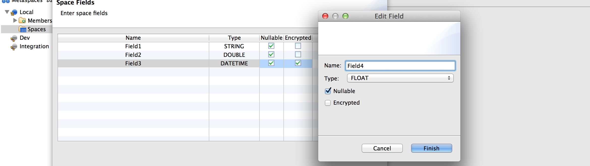
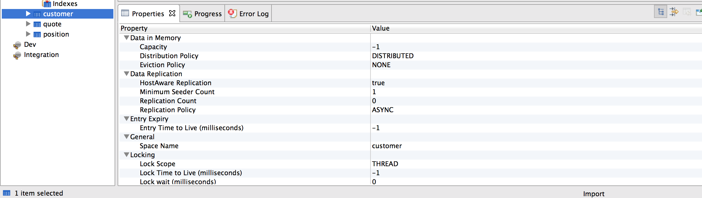

SpaceBar for TIBCO ActiveSpaces®
===========

SpaceBar is a Graphical User Interface (GUI) tool for TIBCO ActiveSpaces that helps developers and operators view and edit the contents of metaspaces.

	<!--
	<ol class="carousel-indicators">
	  <li data-target="#myCarousel" data-slide-to="0" class="active"></li>
	  <li data-target="#myCarousel" data-slide-to="1" class=""></li>
	  <li data-target="#myCarousel" data-slide-to="2" class=""></li>
	  <li data-target="#myCarousel" data-slide-to="3" class=""></li>
	  <li data-target="#myCarousel" data-slide-to="4" class=""></li>
	  <li data-target="#myCarousel" data-slide-to="5" class=""></li>
	  <li data-target="#myCarousel" data-slide-to="6" class=""></li>
	  <li data-target="#myCarousel" data-slide-to="7" class=""></li>
	</ol>
	-->
	

	  

	    
	    

	      Continuous browser
	      
Continuously browse a space and get a real-time view on its data.

	    

	  

	  

	    
	    

	      Browser settings
	      
Set browser options: time scope, prefetch, query limit, filter.

	    

	  

	  

	    
	    

	      Field def editor
	      
Define fields in space def.

	    

	  

	  

	    
	    

	      Data import
	      
Import data from CSV, Excel, or simulation files.

	    

	  

	  

	    
	    

	      Space properties
	      
Space definition attributes.

	    

	  

	  

	    
	    

	      Space default editor
	      
Create space definitions.

	    

	  

	  

	    
	    

	      Space data editor
	      
View and edit tuples.

	    

	  

	

	<a class="left carousel-control" href="#myCarousel" data-slide="prev">‹</a>
	<a class="right carousel-control" href="#myCarousel" data-slide="next">›</a>

SpaceBar provides the following features:

* **Metaspaces**

   * Connect to a metaspace

   * Create/delete a metaspace

   * Show current members

   * Show current spaces

   * Open a system space

   * Resume/suspend a metaspace

* **Spaces**

   * Show space definitions

   * Create a space definition

   * Drop/resume/recover a space

   * Add a new field to an existing space

   * Add and drop indexes

* **Browsing**

   * Browse space data

   * Show real-time updates (continuous browse)

   * Retrieve space size

   * Sort and filter tuples

   * Create, read, update, and delete tuples

   * Compute average tuple size

* **Import/Export**

   * Tuple selection

   * CSV files

   * Spreadsheets

   * Data simulations