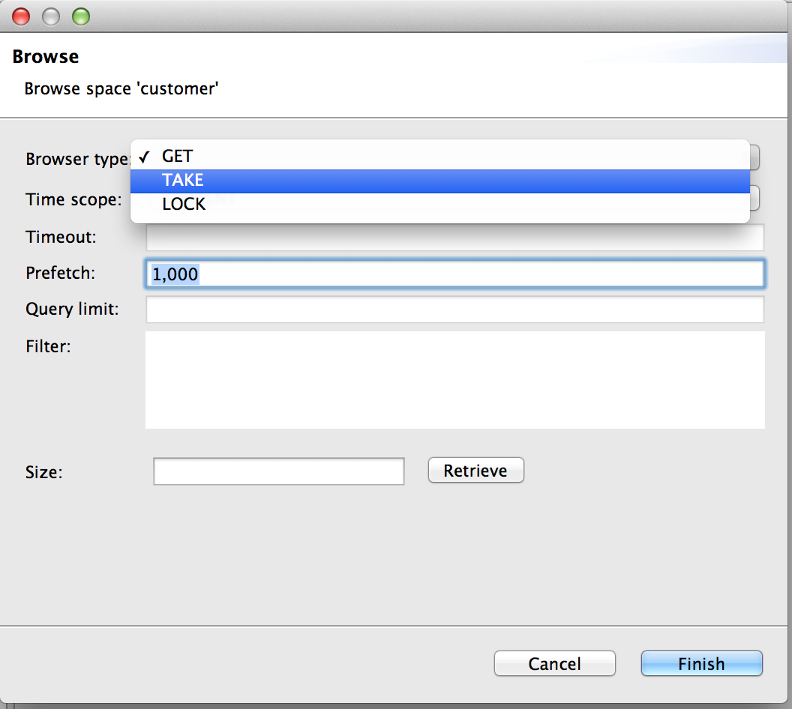
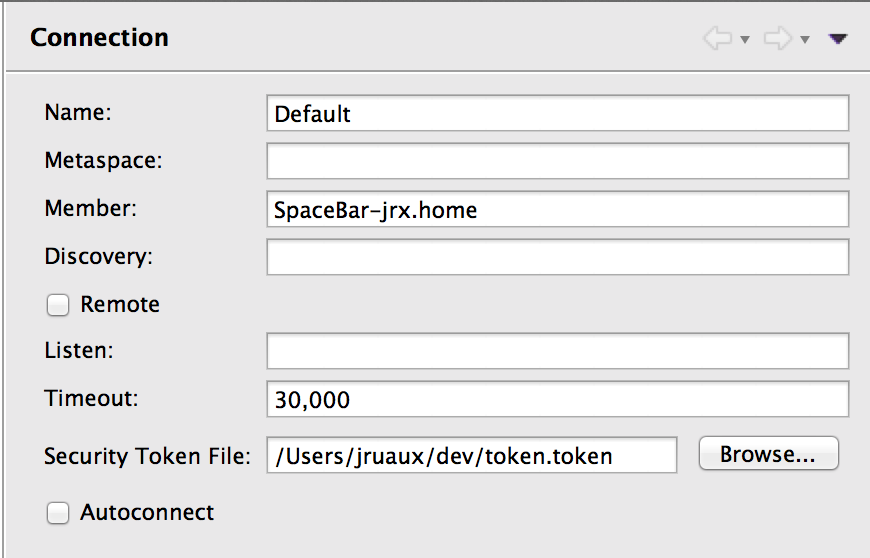
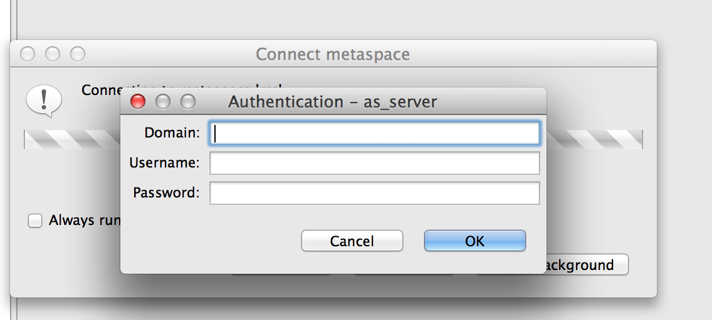

# New and Noteworthy 

### Browser Type

Browser type (get, take or lock) can now be specified in the configuration editor (right-click a space, Browse, Browse...)

### Security Token File

Added support for security token file and identity password in metaspace connection profile.

### Authentication

When authentication is required to connect to a metaspace, a dialog window pops up asking for domain, username and password.

